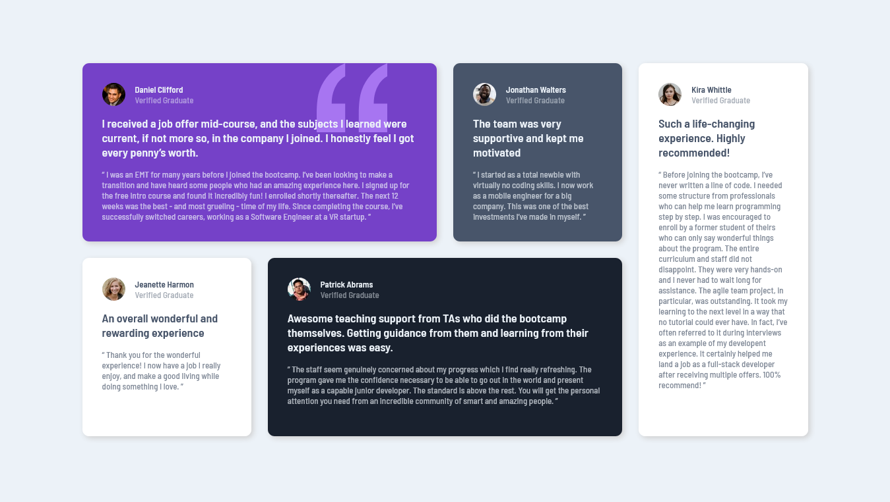

# Frontend Mentor - Testimonials grid section solution

This is a solution to the [Testimonials grid section challenge on Frontend Mentor](https://www.frontendmentor.io/challenges/testimonials-grid-section-Nnw6J7Un7). Frontend Mentor challenges help me improve my coding skills by building realistic projects.

## Table of contents

- [Overview](#overview)
  - [Screenshot](#screenshot)
  - [Links](#links)
- [My process](#my-process)
  - [Built with](#built-with)
  - [What I learned](#what-i-learned)
- [Author](#author)

## Overview

### Screenshot

### Links

- Live Site URL: [Testimonials grid section Awan]()

## My process

### Built with

- Semantic HTML5 markup
- Static Font
- CSS Grid

### What I learned

In this project I learned how to use css grid to make layout.

## Author

- Frontend Mentor - [@soniawan](https://www.frontendmentor.io/profile/soniawan)
